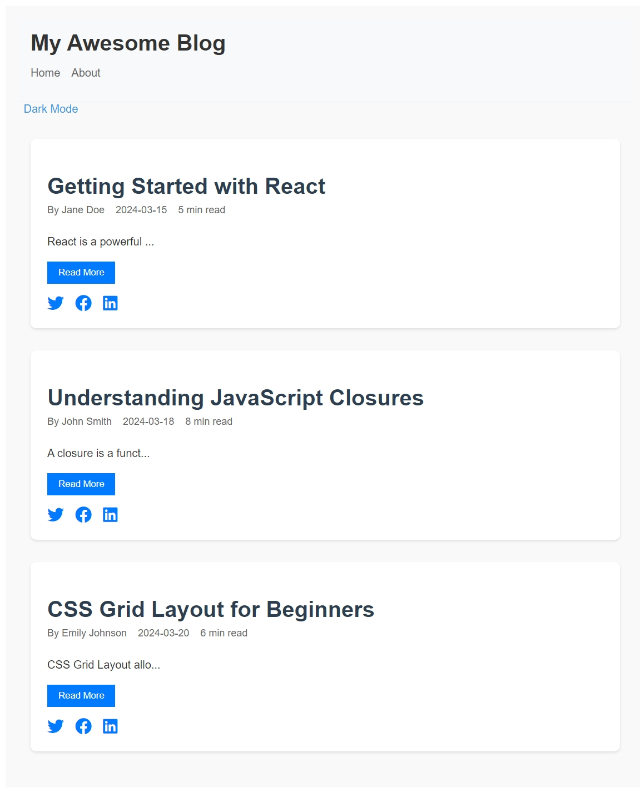
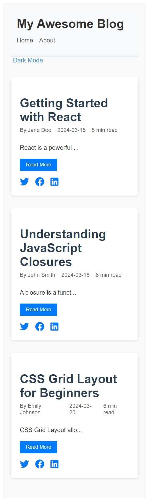

# react-blog
React Blog Project

# My React Blog
A blog platform built with React and Vite.

## Setup Instructions
1. Clone the repository
2. Run `npm install`
3. Run `npm run dev`
4. Open http://localhost:5173 in your browser

## Project Structure
1. src/components/Header.jsx: Contains the Header component, including the navigation and title.
2. src/App.jsx: Main application component that renders the Header and other sections of the blog.
3. src/index.css: Contains the CSS styles for the app, including styles for the Header component.
4. .gitignore: Excludes node_modules, dist, and other unnecessary files from being tracked in Git.

## Screenshot

## What I Learned
1. I learned how to initialize a new Vite project and configure it for React development.
2. I created a Header component, structured it within the app, and applied basic styling.
3. I practiced setting up a Git repository, committing changes, and pushing them to a remote GitHub repository.

## Components Structure
1. BlogPost: Individual blog post display
2. BlogList: Container for multiple posts
3. Header: Navigation and site title

## Styling Approach
I used regular CSS styling the components to ensure clean, reusable styles and a maintainable structure.

## New Features
1. Added BlogPost and BlogList components to display individual posts and a list of posts.
2. Integrated sample data to populate the blog posts dynamically.
3. Applied responsive design for mobile and desktop views.
4. Added all the Bonus Features too

## Screenshots
1. Desktop view: 
2. Mobile view: 

